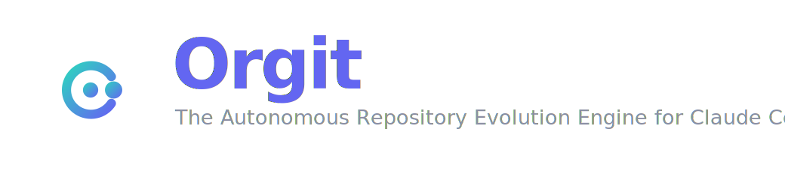

<div align="center">



**Orgit** understands your repository, finds the highest-value improvements, and applies them as small, reversible commits — so your project comes back cleaner, better organized, and with less technical debt.

[](https://github.com/Gerijacki/Orgit/actions/workflows/ci.yml)


[**Quick start**](#example) · [**How it works**](docs/ARCHITECTURE.md) · [**Contributing**](CONTRIBUTING.md)

</div>

<!-- Replace this line with a <20s GIF: analyze → detect → plan → apply → validate → evolved project. See docs/assets/README.md -->
<p align="center"><em>Demo GIF coming soon — see <a href="docs/assets/README.md">docs/assets</a>.</em></p>

---

<details>
<summary><strong>Contents</strong></summary>

- [The problem](#the-problem)
- [The solution](#the-solution)
- [Why Orgit](#why-orgit)
- [What you get](#what-you-get)
- [Example](#example)
- [Features](#features)
- [Use cases](#use-cases)
- [How it works](#how-it-works)
- [Roadmap](#roadmap)
- [Contributing](#contributing)

</details>

---

## The problem

Every real codebase accumulates technical debt: dead code, duplicated logic, oversized files, functions that do too much, drifting conventions. Cleaning it up is slow, repetitive, and easy to postpone — so it never happens. Pointing a raw LLM at the whole repo burns tokens and produces sprawling, risky changes.

## The solution

Orgit behaves like a **senior maintenance engineer**, not an impulsive editor. It never touches a line before it understands the project, and every change follows one disciplined cycle:

```
Understand → Analyze → Detect → Prioritize → Plan → Execute → Validate / Review → Test → Document → Continue
```

Each improvement is small, independent, **reversible**, and comes with a written justification.

## Why Orgit

Pointing a chat assistant at your repo and asking it to "clean this up" gives you a large, unreviewable diff and a big token bill. Orgit is built the opposite way.

|                        | Raw LLM / chat "refactor this" | AI autocomplete (Copilot &co.) | **Orgit**                                                  |
| ---------------------- | ------------------------------ | ------------------------------ | ---------------------------------------------------------- |
| Unit of change         | One giant diff                 | A few lines you're typing      | **Small, independent, reversible commits**                 |
| Safety                 | You hope it compiles           | You review inline              | **Runs your build/test/lint; auto-rolls-back on failure**  |
| Understands the repo   | Only what you paste            | Local buffer                   | **Whole-repo mental model + vector memory**                |
| Token cost             | Re-sends whole files           | N/A                            | **Retrieves only relevant chunks; re-embeds only changes** |
| Big multi-step goals   | Forgets between chats          | —                              | **Persisted missions resumed across many runs**            |
| Every change explained | Rarely                         | No                             | **Four-part justification on every commit**                |

## What you get

- **Remembers big goals across many runs.** State a large objective once (`orgit mission start "modularise the auth layer"`) and Orgit decomposes it into an ordered, dependency-aware **step-by-step plan**, then works through it meticulously — one validated commit per step — across as many sessions as it takes. The goal and exact progress are persisted to `.orgit/`, so it never forgets what you asked, no matter how many iterations later. A planner agent decomposes; worker agents execute steps in parallel; a coordinator tracks it.
- **Two agents check every change.** A **reviewer agent** verifies each edit actually accomplishes its task (no scope creep, no unrelated edits) _and_ the project's own build/test/lint must pass — a change is committed only when it both works and does what it was meant to. On for missions by default; add `--review` to `evolve`.
- **A cleaner repo, safely.** Every task is its own git commit; anything that fails the project's own build/test/lint is rolled back automatically — errors are never hidden. Use `evolve --branch` to keep your base branch pristine and open the result as a PR. `mission run --parallel` runs genuinely-independent steps concurrently in isolated git worktrees (parallel test runs, not just parallel generation).
- **Token-frugal by design.** A local vector memory (LanceDB + on-device embeddings) means Orgit retrieves the few relevant chunks instead of re-sending whole files to Claude, and re-indexing only touches changed files.
- **Duplication detection with zero extra tokens.** Orgit reuses the embeddings it already computed to find near-duplicate code _across files_ — copy-paste and parallel implementations a text scanner misses — without spending a single Claude token.
- **It learns your project.** Conventions (indentation, quotes, semicolons, test framework) are derived and persisted in `.orgit/`, then fed into every change so edits match your house style — and each run gets smarter.
- **Watch your debt shrink.** Each run records a 0–100 **health score**; `audit` and `status` show the trend across runs (`▲ +4 since last run`).
- **Fast, and yours to steer.** Independent task edits are generated **in parallel** (`--concurrency N`), so a big plan doesn't crawl. Run hands-off (automode) or add `--interactive` to approve each task (apply / skip / quit).
- **Documents what it changes.** Add `--docs` and Orgit writes developer docs for the code it just refactored — into `.orgit/` by default, or committed into your repo with `--docs-commit`.
- **Works with your Claude, either way.** Uses the `claude` CLI on your machine (your subscription, no per-token cost) by default, or the Anthropic API when you prefer.

## Example

```bash
# Install (from source, for now)
pnpm install && pnpm build && npm link   # exposes `orgit`

# Point it at any project
orgit doctor                 # check environment + which Claude backend is live
orgit analyze -C ../my-app   # build the mental model + index memory
orgit audit   -C ../my-app   # report opportunities (changes nothing)
orgit plan    -C ../my-app   # produce a plan of small reversible tasks
orgit evolve  -C ../my-app --dry-run   # preview the edits
orgit evolve  -C ../my-app             # apply them, one validated commit at a time
```

> Orgit needs a git repository and a clean working tree before it will modify anything — that's how it guarantees every change is reversible.

For a **large, multi-step refactor** that should be remembered and completed over time:

```bash
orgit mission start "extract the duplicated validation into a shared module"
orgit mission status        # the goal + a step-by-step checklist
orgit mission run           # advance runnable steps; run again anytime to continue
orgit mission run --continuous   # keep going until it's complete
```

Prefer a **dashboard**? `orgit ui` starts a local web UI (bound to `127.0.0.1`, zero extra dependencies) to watch the health score, current analysis, mission progress and reports — and launch analyze/audit/plan/evolve/mission runs with progress streaming live:

```bash
orgit ui --open          # open http://127.0.0.1:4319 in your browser
```

## Features

| Command         | Mode                          | What it does                                                                                                                                                 |
| --------------- | ----------------------------- | ------------------------------------------------------------------------------------------------------------------------------------------------------------ |
| `orgit analyze` | Understand                    | Build the repository mental model and index it into memory                                                                                                   |
| `orgit audit`   | Auditor                       | Detect and rank improvement opportunities — report only                                                                                                      |
| `orgit plan`    | Planning                      | Turn opportunities into a plan of small, reversible tasks                                                                                                    |
| `orgit evolve`  | Execution / Auto / Continuous | Run the full cycle and apply improvements (`--dry-run`, `--max N`, `--continuous`, `--branch`, `--concurrency N`, `--interactive`, `--docs`, `--docs-level`) |
| `orgit improve` | —                             | Apply the single highest-value improvement                                                                                                                   |
| `orgit mission` | Goal-directed                 | `start "<goal>"` / `run` / `status` / `abandon` — a large refactor Orgit remembers and completes step by step across runs                                    |
| `orgit docs`    | —                             | Generate an architecture overview from the mental model                                                                                                      |
| `orgit explain` | —                             | Answer a question about the repo using memory + Claude                                                                                                       |
| `orgit ui`      | Dashboard                     | Local web UI to monitor analysis/health/mission and launch runs live (`--port`, `--open`)                                                                    |
| `orgit doctor`  | —                             | Diagnose environment and Claude backends                                                                                                                     |
| `orgit status`  | —                             | Show workspace and memory state                                                                                                                              |

Global flags: `-C <dir>` target a repo · `-p cli\|api\|auto` pick a backend · **`-m, --model <name>`** choose the model (`opus`/`sonnet`/`haiku`/`fable` or a full id).

## Use cases

- **Legacy projects** — pay down years of debt incrementally, with a safety net.
- **Open-source repos** — keep contributions clean and conventions consistent.
- **Monorepos & startups** — modularize and tidy without a big-bang rewrite.
- **Library maintainers** — evolve toward a healthier structure without breaking behaviour.

## How it works

See [docs/ARCHITECTURE.md](docs/ARCHITECTURE.md) for the full design: the provider abstraction (CLI vs API), the token-saving memory layer, the multi-agent mission system, and the reversible per-task executor. Repository automation (CI, Dependabot auto-merge, automated releases, external-PR handling) is documented in [docs/AUTOMATION.md](docs/AUTOMATION.md).

## Roadmap

Orgit is under active development. On the horizon:

- [ ] **More languages** — deeper detector + chunker support beyond TS/JS (Python, Go, Rust, Java).
- [ ] **Richer static detectors** — cyclomatic complexity and dependency-cycle detection from the module graph.
- [ ] **PR-native missions** — open a pull request per mission step, not just local commits.
- [ ] **Run it in CI** — a GitHub Action that audits every PR and comments the health delta.
- [ ] **Pluggable rules** — bring-your-own detectors and house-style policies.

Have an idea? [Open a discussion](https://github.com/Gerijacki/Orgit/discussions) or a [feature request](https://github.com/Gerijacki/Orgit/issues/new?template=feature_request.md).

## Contributing

Contributions are welcome — see [CONTRIBUTING.md](CONTRIBUTING.md). Good first issues: new static detectors, additional language support in the chunker, and report formats. Commits follow [Conventional Commits](https://www.conventionalcommits.org/) so releases are automated.

## License

[MIT](LICENSE) © Gerijacki

---

<div align="center">

If Orgit helps keep your codebase healthy, **give it a ⭐** — it helps other developers find it.

<sub>Autonomous repository evolution · AI refactoring · technical-debt reduction · powered by Claude Code.</sub>

</div>
